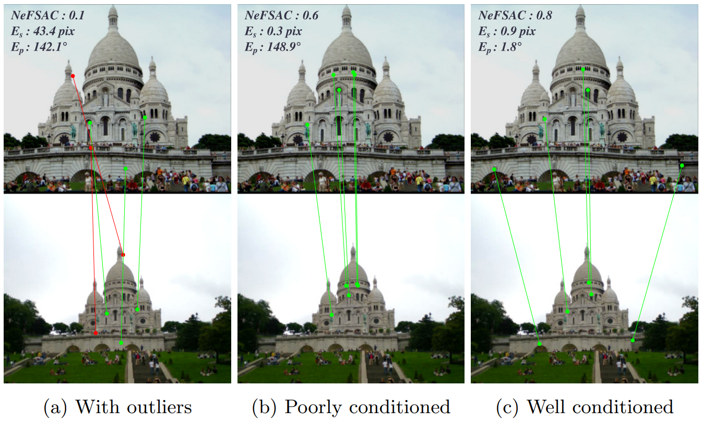

# NeFSAC
Code for the ECCV 2022 paper NeFSAC: Neurally Filtered Minimal Samples



What you will find in this repository:
- Pretrained models for NeFSAC for Essential matrix estimation and Fundamental matrix estimation on both [KITTI](https://www.cvlibs.net/datasets/kitti/eval_odometry.php) and [PhotoTourism](http://phototour.cs.washington.edu/)
- Sample code to train NeFSAC on [KITTI](https://www.cvlibs.net/datasets/kitti/eval_odometry.php)
- A simple pytorch-only RANSAC implementation to showcase how to integrate NeFSAC into any RANSAC


## What is NeFSAC

NeFSAC is a lightweight model which is trained to recognize good minimal samples in RANSAC at a glance.

It learns common motion and depth patterns of correct correspondences in a dataset, and uses this prior to estimate the likelihood that a minimal set of correspondences could lead to a good model estimate. This knowledge can then be used in [RANSAC](https://dl.acm.org/doi/pdf/10.1145/358669.358692) to process the promising minimal samples first, and terminate much earlier. Moreover, it learns to recognize and avoid the degenerate patterns which lead to unstable model estimates, thus improving the accuracy of estimation on average.

In our experiments, we consistently observed improvements in accuracy in pose estimation (both E and F matrix), speed-ups between 2x and 10x on a good [USAC](https://ieeexplore.ieee.org/stamp/stamp.jsp?arnumber=6365642) implementation, and a great generalization capability. More details are in the [paper](https://arxiv.org/pdf/2207.07872.pdf).

## I want to quickly run NeFSAC

You can run NeFSAC on our simple pytorch-RANSAC on some sample images.
You only need to install dependencies, and then run:

```
python demo.py
```

If your torch installation does not support CUDA, you can still run:

```
python demo.py --device cpu
```

You can also specify other image pairs by specifying parameters --image1 and --image2.

Note that this is a very simple baseline to showcase how NeFSAC is used in a RANSAC context. Best results are obtained with state-of-the-art RANSAC implementations. We are working on making available a NeFSAC sampler in [MAGSAC++](https://github.com/danini/magsac), stay tuned!


## How to train NeFSAC

We observed impressive generalization capabilities with NeFSAC, so re-training on a new dataset might not be necessary. Nonetheless, we provide our training procedure in a Pytorch Lightning module in `source/trainer.py`, and show how data is preprocessed in `source/data.py`.

We provide code for reproducing training on KITTI. You should first download the KITTI odometry dataset in some local directory `<KITTI_DIR>` and then run:

```
python train.py --kitti_path <KITTI_DIR>
```

Further options are available to customize the training, please check them out with `python train.py --help`.


## How to test NeFSAC into my RANSAC framework

Implementations and frameworks for RANSAC can vary widely, so we don't provide a ready module to use here. However, the implementation of a NeFSAC sampler from a torschscript model is straghtforward wherever torchscript is supported. A full Python implementation can be found in `source/ransac/samplers.py`.

